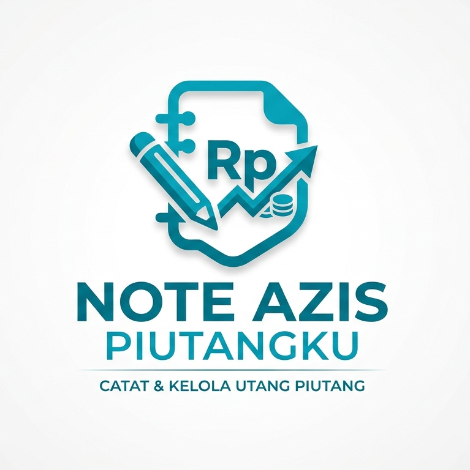

# 📱 PiutangKu - Professional Debt Management App



**PiutangKu** adalah solusi manajemen keuangan modern berbasis mobile yang dirancang khusus untuk membantu individu maupun pelaku UMKM dalam mencatat, melacak, dan mengelola utang piutang secara digital. Dibangun dengan **Flutter** dan **SQLite**, aplikasi ini menawarkan performa yang cepat, aman, dan sepenuhnya offline.

---

## 🌟 Fitur Utama (Key Features)

Aplikasi ini dilengkapi dengan fitur esensial yang sangat dibutuhkan untuk pengelolaan keuangan yang rapi:

- ✅ **Pencatatan Cepat:** Masukkan data debitur, jumlah piutang, dan keterangan hanya dalam hitungan detik.
- ✅ **Database Lokal (Offline):** Keamanan data prioritas utama. Semua data tersimpan di perangkat pengguna menggunakan **sqflite**.
- ✅ **Real-time List View:** Pantau semua daftar piutang dengan tampilan yang bersih dan informatif.
- ✅ **Sistem Hapus Data:** Kelola catatan yang sudah tidak diperlukan dengan fitur penghapusan sekali klik.
- ✅ **User Experience (UX) Intuitif:** Desain antarmuka yang sangat mudah dipahami, bahkan oleh pengguna awam sekalipun.

---

## 📸 Tampilan Aplikasi (Screenshots)

| Splash Screen | Form Input | List Data |
|---|---|---|
|  |  |  |

---

## 🛠️ Teknologi & Tools

Project ini menggunakan standar pengembangan aplikasi mobile terbaru:

- **Framework:** [Flutter](https://flutter.dev/) (Multi-platform support)
- **Language:** Dart
- **Local Database:** [Sqflite](https://pub.dev/packages/sqflite) (SQLite for Flutter)
- **State Management:** Provider / Clean Architecture
- **Icons & Branding:** Custom Launcher Icons

---

## 🚀 Mengapa Membeli Source Code Ini?

Bagi pengembang atau pebisnis, source code ini adalah investasi tepat:
1. **Clean Code:** Kode tersusun rapi dan mudah untuk dimodifikasi kembali (*highly customizable*).
2. **Ready to Deploy:** Sudah termasuk konfigurasi launcher icon dan penamaan aplikasi yang profesional.
3. **Bug Free:** Telah melalui tahap pengujian fungsional dasar.
4. **Ringan:** Ukuran aplikasi sangat kecil dan berjalan mulus di perangkat low-end sekalipun.

---

## 📦 Cara Instalasi

1. **Clone Repository:**
   ```bash
   git clone [https://github.com/AzisCode412/piutangku.git](https://github.com/AzisCode412/piutangku.git)
   
2. **Install Dependencies:**
   ```bash
   flutter pub get

3. **Run Application:**
   Pastikan emulator atau perangkat fisik sudah terhubung, lalu jalankan:
   ```bash
   flutter run

---

## 💰 Cara Mendapatkan Source Code

Repositori ini disediakan untuk tujuan dokumentasi dan demo fitur. Untuk mendapatkan Source Code Lengkap (Full Access) yang siap dipublikasikan ke Play Store, silakan hubungi saya melalui jalur berikut:

Instagram: @teman_tugasmu_ (Respon Cepat)

GitHub: Kirim pesan melalui profil atau ajukan Request Access.

---

## Apa yang Anda dapatkan?

1. Full Source Code Project Flutter.
2. Dokumentasi struktur database SQLite.
3. Bebas konsultasi/support jika ada kendala instalasi.
4. Gratis update fitur di masa mendatang.

---

## 🤝 Kontribusi & Lisensi
Saya terbuka untuk masukan atau laporan bug melalui fitur Issues di GitHub untuk penyempurnaan aplikasi.

---

### Catatan Penting:
1. **Path Gambar:** Pastikan folder di GitHub kamu adalah `assets/img/` dan nama filenya menggunakan spasi (sesuai kode `%20` di atas) atau ganti nama filenya di folder menjadi `piutangku-1.jpeg` agar lebih aman.
2. **Logo:** Jangan lupa pastikan file `logo.png` ada di folder `assets` supaya banner paling atas tidak pecah.
3. **About Section:** Ingat untuk mengisi *Topics* di GitHub (seperti: `flutter`, `sqlite`, `mobile-app`) agar orang lebih mudah menemukan project ini.


Copyright © 2026 Zen Al Azis. All rights reserved.
